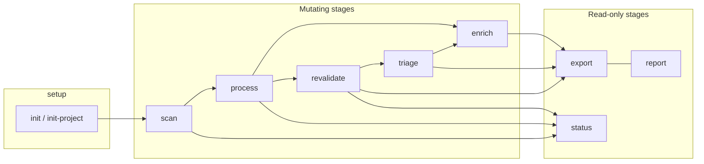
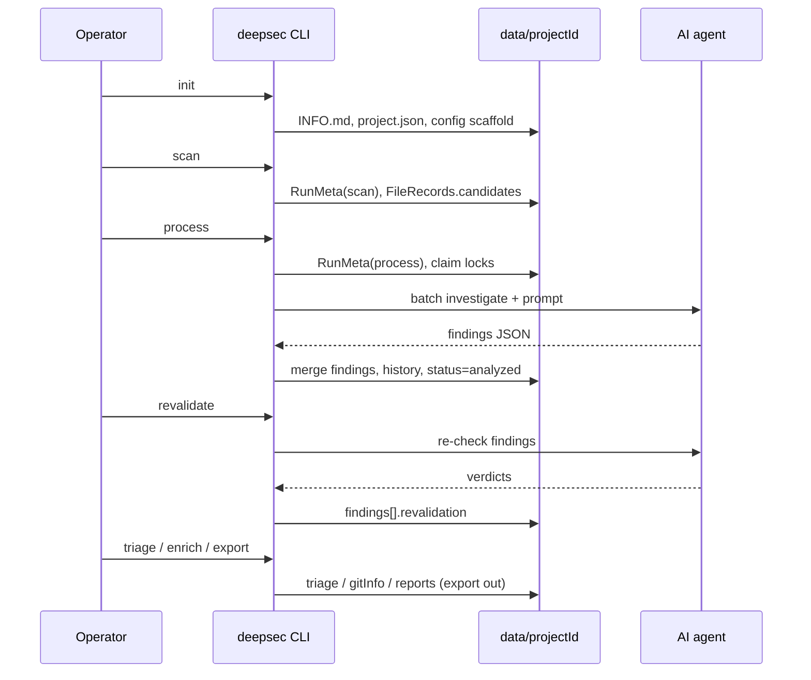

# DeepSec Pipeline & Architecture

**Source of truth:** cloned repo at `/tmp/grok-goal-f8e64663ee8a/implementer/deepsec` (upstream: `vercel-labs/deepsec`).

**Scope of this document:** pipeline stages, data flow through `FileRecord` fields, resumability, idempotency, locking, `RunMeta` lifecycle, status lifecycle, and diff/direct mode. Not covered: matcher authoring, plugin authoring beyond their pipeline hooks, sandbox orchestration internals beyond merge semantics, agent SDK details.

---

## 1. High-level model

DeepSec is an **append-only, file-centric** security pipeline. The unit of work is a **source file**, not a finding. Every stage reads/writes a consistent on-disk representation under `data/<projectId>/`. Stages are **idempotent**: re-running merges new information rather than overwriting.

```
init  →  scan  →  process  →  revalidate  →  triage  →  enrich  →  export / report / status
              ↘         ↗
           (diff / direct: scanFiles + process in one CLI invocation)
```



### Design pillars (from architecture docs + core types)

1. **One file = one `FileRecord`.** Scanner, processor, and revalidator operate on files; per-file locking and merge fall out naturally.
2. **Append-only analysis history.** Re-process appends `analysisHistory` and merges findings by signature.
3. **Additive merge model.** Scan merges candidates; process merges findings; revalidate/triage annotate findings; enrich fills `gitInfo`. Nothing is deleted by pipeline stages.

---

## 2. On-disk layout

```
data/<projectId>/
├── project.json              # ProjectConfig: rootPath, githubUrl, createdAt
├── INFO.md                   # Repo context injected into AI prompts (curated)
├── SETUP.md                  # Agent setup prompt (init scaffold; optional later)
├── config.json               # priorityPaths, promptAppend, ignorePaths (optional)
├── tech.json                 # DetectedTech tags from last scan (scanner write)
├── files/                    # FileRecord per source file: <rel/path>.json
│   └── path/to/file.ts.json
├── runs/                     # RunMeta per invocation: <runId>.json
│   └── YYYYMMDDHHmmss-<16hex>.json
├── reports/                  # report.md / report.json (overwrite on re-run)
└── .process.lock/            # Transient mkdir mutex (claim phase only)
    └── owner                 # { runId, acquiredAt }
```

- Path safety: `projectId` / `runId` are single path segments; `filePath` is relative POSIX under project root (no `..`, no `\`).
- Data root: `DEEPSEC_DATA_ROOT` env or default `data` (relative to CWD of the CLI, typically `.deepsec/`).
- Gitignore pattern from `init`: ignore `files/`, `runs/`, `reports/`, `project.json`; keep `INFO.md` / `SETUP.md` tracked.

---

## 3. Stage-by-stage flow

### 3.1 `init` / `init-project`

| | |
|---|---|
| **Command** | `deepsec init` → scaffold `.deepsec/` workspace; `deepsec init-project <root>` → register another codebase |
| **Writes** | `package.json`, `deepsec.config.ts`, `AGENTS.md`, `.gitignore`, `data/<id>/{project.json,INFO.md,SETUP.md}` |
| **RunMeta** | None |
| **FileRecord** | None |

Purpose: establish workspace + first `projects[]` entry and empty INFO.md template. No scan state yet.

---

### 3.2 `scan`

| | |
|---|---|
| **Command** | `deepsec scan [--project-id] [--root] [--matchers slug,…]` |
| **Core** | `packages/scanner/src/index.ts` → `scan()` / `RegexScannerDriver` |
| **AI** | None (regex matchers only) |
| **RunMeta** | `type: "scan"`, `phase: running → done`, `scannerConfig.matcherSlugs` |

**Algorithm:**

1. Resolve project root (`--root` > config project root > `project.json:rootPath`).
2. `ensureProject()` — create/update `project.json` (rootPath, githubUrl from `git remote`).
3. Tech detection → write `tech.json`; gate matchers via `requires` (unless explicit `--matchers`).
4. `createRunMeta({ type: "scan" })` → write run JSON.
5. Glob files per matcher `filePatterns` (with `IGNORE_DIRS` + config `ignorePaths` + deepsec data globs).
6. For each matcher hit: load-or-create `FileRecord`, **merge** candidates (dedupe key below), update `lastScannedAt`, `lastScannedRunId`, `fileHash`.
7. Write all upserted records; `completeRun(..., "done", { filesScanned, candidatesFound })`.

**Important scan invariants:**

- Only files that produce **at least one candidate** get a `FileRecord` in full-repo `scan()` (driver skips empty match lists).
- **Re-scan does not reset `status`** from `analyzed` back to `pending`. Comment in driver: *“Only reset to pending if not already analyzed (re-scanning doesn't invalidate previous analysis)”* — and the code never resets status on scan at all for existing records.
- Candidate merge key: `(vulnSlug, matchedPattern, lineNumbers.join(","))`.

```
FileRecord after scan
─────────────────────
candidates[]       ← merged regex hits
lastScannedAt      ← now
lastScannedRunId   ← this scan runId
fileHash           ← sha-256 of normalized content (CRLF→LF)
status             ← "pending" only for NEW records; preserved if already set
findings / history ← untouched
```

---

### 3.3 `process` (standard mode)

| | |
|---|---|
| **Command** | `deepsec process [--concurrency] [--batch-size] [--limit] [--filter] [--reinvestigate] [--only-slugs] [--skip-slugs] [--run-id] …` |
| **Core** | `packages/processor/src/index.ts` → `process()` |
| **AI** | Agent backends: `codex` / `claude-agent-sdk` / `pi` (+ plugin agents) |
| **RunMeta** | `type: "process"`, `processorConfig: { agentType, model, modelConfig, invocationMode: "scan" }` |

**Work selection (not direct mode):**

| Mode | Files selected |
|------|----------------|
| Default | `status ∈ {pending, error}` **or** `status=processing` with **reclaimable** lock |
| `--reinvestigate` (bool) | All file records |
| `--reinvestigate N` | Files lacking a **productive** `analysisHistory` entry for this agent with `reinvestigateMarker === N` and `phase !== "revalidate"` and `usage.outputTokens > 0` |

Then: optional manifest filter, `--only-slugs` / `--skip-slugs`, noise-tier + priorityPaths sort, `--filter` path prefix, `--limit`.

**Claim → batch → writeback:**

1. Acquire per-project **process lock** (`data/<id>/.process.lock` via atomic `mkdir`).
2. Re-read each candidate; claim if pending/error/reclaimable (or force modes); set `status=processing`, `lockedByRunId=runId`, `lockedAt=now`; write record.
3. Release process lock.
4. Batch by directory (`batchCandidates`, default size 5).
5. Concurrent workers (`concurrency`, default `availableParallelism - 1`).
6. Per batch: assemble prompt (core + tech highlights + slug notes + INFO.md + promptAppend), call agent `investigate()`.
7. Merge findings into record; append `analysisHistory` (`phase: "process"`); clear lock; set `status=analyzed` (or `error` if missing from results / batch threw); optional sync `enrichFileRecord` (git committers).

**Resume via `--run-id`:** if provided and existing meta has `phase === "done"`, no-op return; otherwise reuse that `runId` (does not re-create meta). New runs always create a new `RunMeta`.

**Idempotent re-run (default):** already-`analyzed` files are skipped → only unfinished work runs. Failed batches leave `status=error` → next process retries them.

---

### 3.4 `process` direct / diff mode

Triggered when any of: `--diff`, `--diff-staged`, `--diff-working`, `--files`, `--files-from`.

Lifecycle (CLI `processDirectMode`):

1. Resolve file list via `resolveFiles()` (git diff names or explicit paths; apply scanner ignore globs unless `--no-ignore`).
2. `ensureProject` (auto-create project if needed).
3. **`scanFiles()`** — scoped scan:
   - Writes a `FileRecord` for **every listed file**, even with **zero** candidates (so process has a record).
   - RunMeta: `scannerConfig.mode: "files"`, `source` e.g. `git-diff:origin/main`, `fileCount`.
   - Candidate merge same as full scan.
4. **`process({ filePaths, source })`** — **bypasses** pending/error filter, noise sort, and reinvestigate; investigates exact list.
   - RunMeta: `processorConfig.invocationMode: "direct"`, `source`.
5. Optional PR comment (`--comment-out`); **exit 1** if any **net-new** findings or errored batches (CI gate).

```
git diff / files  →  scanFiles (records always)  →  process(direct)  →  exit code
```

---

### 3.5 `revalidate`

| | |
|---|---|
| **Command** | `deepsec revalidate [--min-severity] [--force] [--limit] …` |
| **Core** | `processor.process` counterpart: `revalidate()` |
| **AI** | Same agent backends; agent re-reads code + git history |
| **RunMeta** | `type: "revalidate"` |

**Selection:** files with findings where at least one finding lacks `revalidation` (unless `--force`), optional min severity / slug / path / limit filters.

**Writeback:**

- Match verdicts to findings by `(filePath, title)`.
- Set `finding.revalidation = { verdict, reasoning, adjustedSeverity?, duplicateOf?, revalidatedAt, runId, model }`.
- Optionally adjust `finding.severity` if `adjustedSeverity` set.
- **Two-pass duplicates:** non-`duplicate` first; then `duplicate` only if primary exists in same file and has non-duplicate revalidation. Invalid DUPEs are rejected (finding stays unrevalidated for next run).
- Append `analysisHistory` with `phase: "revalidate"` (cost split across batch files).
- **Does not lock FileRecords** (`lockedByRunId` unused). Shutdown still flips RunMeta to `error` on SIGINT.

Verdicts: `true-positive` | `false-positive` | `fixed` | `uncertain` | `duplicate` | (manual only) `accepted-risk`.

---

### 3.6 `triage`

| | |
|---|---|
| **Command** | `deepsec triage [--severity MEDIUM] [--force] [--limit]` |
| **Core** | `packages/processor/src/triage.ts` |
| **AI** | Claude Agent SDK only; **no code reading** (title/description only); cheap |
| **RunMeta** | Created with `type: "revalidate"` and `processorConfig.agentType: "triage"` (type reuse quirk) |

**Selection:** findings matching severity; skip if already have `triage` unless `--force`.

**Writeback:** set `finding.triage = { priority: P0|P1|P2|skip, exploitability, impact, reasoning, triagedAt, model }`. Batch size 30. No file-level locks.

---

### 3.7 `enrich`

| | |
|---|---|
| **Command** | `deepsec enrich [--filter] [--force] [--min-severity] [--concurrency]` |
| **Core** | `packages/processor/src/enrich.ts` |
| **AI** | None (git log; optional ownership plugin HTTP) |

**Selection:** records with `findings.length > 0`; skip if `gitInfo` already set unless `--force`.

**Writeback:** `gitInfo = { recentCommitters[], enrichedAt, ownership? }`. Note: `process`/`revalidate` already call lightweight `enrichFileRecord` (committers only) after each successful file write; full `enrich` command also runs ownership oracle if plugin registered.

Optional: `commitAndPushData` after successful enrich (CLI hook for shared data repos).

---

### 3.8 Read-only: `export` / `report` / `status`

| Command | Behavior |
|---------|----------|
| **export** | Flatten findings to JSON or `md-dir` tree by severity; includes revalidation, triage, ownership/assignee heuristics. Does not mutate FileRecords. |
| **report** | Write `data/<id>/reports/report{.md,.json}` (or `report-<runId>.*`); filters to `status=analyzed` (optional filter by analysisHistory runId). **Overwrites** reports (not append-only). |
| **status** | Aggregate: file status counts, finding severity counts, revalidation/triage progress, recent RunMeta list. |

---

### 3.9 Resume semantics (operator view)

There is **no separate `resume` subcommand**. Resume is:

1. **Re-run the same stage** — default selectors skip finished work (`analyzed` files; findings with revalidation/triage).
2. **`process --run-id <id>`** — continue under an existing non-done process run id (rare; mostly for tooling continuity).
3. **`--reinvestigate` / `--reinvestigate N`** — intentional second passes; N-wave is idempotent per agent.
4. **Stale lock reclaim** — crashed/interrupted process runs leave `processing` files; next process reclaims when lock is abandoned (see §5).

Getting-started guarantee: *If a batch fails or you Ctrl-C, run the same command again — nothing to clean up.*

---

## 4. Data flow: `FileRecord` fields

### 4.1 Field map by producer

| Field | Written/updated by | Merge / semantics |
|-------|--------------------|-------------------|
| `filePath`, `projectId` | scan / scanFiles (create) | Immutable identity |
| `candidates[]` | scan, scanFiles | Union by `(vulnSlug, matchedPattern, lines)` |
| `lastScannedAt`, `lastScannedRunId`, `fileHash` | scan, scanFiles | Last-write-wins on scan |
| `findings[]` | process (merge append); revalidate/triage annotate nested fields | Signature `vulnSlug::normalizedTitle`; first `producedByRunId` wins |
| `analysisHistory[]` | process (`phase: process`), revalidate (`phase: revalidate`) | Append-only; never delete |
| `gitInfo` | process/revalidate sync enrich; `enrich` command | Prefer keep ownership; refresh committers |
| `status` | process claim/complete/error; scan only sets on create | See §4.2 |
| `lockedByRunId`, `lockedAt` | process claim / clear | Empty when free |

### 4.2 Status lifecycle

```
                 scan creates new record
                          │
                          ▼
                     ┌─────────┐
          ┌────────►│ pending │◄──── process retries (from error)
          │         └────┬────┘
          │              │ process claim (under project lock)
          │              ▼
          │         ┌────────────┐
          │         │ processing │  lockedByRunId set
          │         └─────┬──────┘
          │               │
          │     ┌─────────┴──────────┐
          │     ▼                    ▼
          │ ┌────────┐          ┌─────────┐
          │ │analyzed│          │  error  │── re-run process ──┐
          │ └────────┘          └─────────┘                    │
          │     ▲                                              │
          │     │  successful agent result                     │
          └─────┴──────────────────────────────────────────────┘

  reclaim path: processing + abandoned lock → re-claimed as processing
```

| Status | Meaning |
|--------|---------|
| `pending` | Scanned (or created); awaits AI investigation |
| `processing` | Claimed by a process run (`lockedByRunId` + `lockedAt`) |
| `analyzed` | At least one successful process writeback for this file |
| `error` | Batch failed or file absent from agent results; retriable |

**Revalidate / triage / enrich do not change `status`.**

### 4.3 Finding enrichment nesting

```
Finding
├── severity, vulnSlug, title, description, lineNumbers, recommendation, confidence
├── producedByRunId          # first discovery run (stable under dedupe)
├── revalidation?            # revalidate stage
│   ├── verdict, reasoning, adjustedSeverity?, duplicateOf?
│   └── revalidatedAt, runId, model
└── triage?                  # triage stage
    ├── priority, exploitability, impact, reasoning
    └── triagedAt, model
```

### 4.4 Pipeline field flow (ASCII)

```
  SCAN                         PROCESS                         REVALIDATE
  ────                         ───────                         ──────────
  candidates ─────────────────► prompt highlights
  fileHash / lastScanned*       findings ← merge append
  status=pending (new)          analysisHistory ← process entry
                                status analyzed|error
                                lockedByRunId claim/clear
                                gitInfo.recentCommitters (sync)

                                       findings[] ─────────────► revalidation
                                       analysisHistory ← revalidate entry

  TRIAGE                          ENRICH                         EXPORT
  ──────                          ──────                         ──────
  findings[].triage               gitInfo (committers+ownership)  read-only view
```

---

## 5. Resumability, idempotency, locking

### 5.1 Layers of concurrency control

| Layer | Mechanism | Scope | Held for |
|-------|-----------|-------|----------|
| **A. Project claim mutex** | Atomic `mkdir` on `data/<id>/.process.lock` + `owner` file | One claim phase per project | Seconds (select+write locks) |
| **B. Per-file lock** | `lockedByRunId` + `lockedAt` + `status=processing` | One file | Entire investigation of that file |
| **C. Run liveness** | RunMeta `phase` + `pid` + `hostname` | One process/revalidate invocation | Until complete/error/shutdown |

Real AI work runs **outside** layer A, so two processes can investigate **disjoint** claimed file sets in parallel.

### 5.2 `isReclaimableLock` (per-file)

A `processing` file locked by another `runId` is reclaimable if **any**:

1. Owner RunMeta is missing/corrupt, **or** `phase ∈ {done, error}`
2. Owner recorded `pid` + `hostname === localHostname` and **PID is dead** (`process.kill(pid, 0)` → ESRCH)
3. `lockedAt` missing (legacy → treat as old) **or** age ≥ **`STALE_LOCK_MS` = 1 hour**

Otherwise skip (another live run owns it). False reclaim is considered catastrophic (findings clobber); false skip only costs a retry.

### 5.3 Graceful shutdown

`registerActiveRun` installs SIGINT/SIGTERM/`beforeExit` handlers that `completeRun(..., "error")` for active runs so locks become reclaimable **immediately** (no 1h wait). SIGKILL/OOM rely on PID-liveness check.

### 5.4 Process lock staleness

Project `.process.lock` older than 1h is force-removed. Acquire polls every 200ms, default timeout 30s.

### 5.5 Merge / idempotency rules

| Artifact | Dedup / merge key | Re-run behavior |
|----------|-------------------|-----------------|
| Candidates | slug + pattern label + lineNumbers | Additive union |
| Findings | `vulnSlug + ":" + title.trim().toLowerCase()` (actual: `::` separator) | Append only **net-new**; preserve existing including revalidation/triage |
| `producedByRunId` | set only on first insert | Never updated on re-report of same signature |
| `analysisHistory` | append always | Includes reinvestigate markers; revalidate phase entries ignored for process wave N |
| Revalidation | per finding; skip if present unless `--force` | Invalid DUPEs stay unrevalidated |
| Triage | per finding; skip if present unless `--force` | |
| gitInfo | skip if present unless `--force` (enrich cmd) | process sync always refreshes committers on success path |
| Reports | full overwrite | Not incremental |

**Sandbox multi-worker merge** (`mergeFileRecord` in `sandbox/merge-records.ts`) when concurrent sandbox tarballs land:

- History union by `runId`
- Findings union by same signature; field-merge keeps either side’s revalidation/triage
- Status: `analyzed` wins
- Prefer incoming for scan-time fields and locks

### 5.6 Reinvestigate waves

- `--reinvestigate` (bare): force all files again; still **merges** findings (does not wipe).
- `--reinvestigate N`: productive process analyses stamp `reinvestigateMarker: N`; same N + same agent skips done files (idempotent resume of a multi-sandbox wave). Bump N for a new generation.

### 5.7 Cost accounting idempotency note

Batch cost/tokens are **divided by number of files** written in that batch so summing `analysisHistory` does not inflate metrics by batch size.

---

## 6. `RunMeta` lifecycle

### 6.1 Identity

```
runId = YYYYMMDDHHmmss + "-" + 16 hex chars   # sortable, high entropy
```

### 6.2 State machine

```
createRunMeta()
    │
    │  phase: "running"
    │  createdAt: now
    │  pid: process.pid
    │  hostname: os.hostname()
    │  stats: {}
    ▼
 writeRunMeta  ──────────────────────────────┐
    │                                        │
    │  work…                                 │ SIGINT/SIGTERM / throw
    │                                        ▼
    │                               completeRun(..., "error")
    ▼
 completeRun(..., "done" | "error", stats?)
    │
    │  phase terminal
    │  completedAt: now
    │  stats merged
    ▼
 written permanently under runs/
```

| Field | Role |
|-------|------|
| `type` | `"scan" \| "process" \| "revalidate"` — triage reuses `"revalidate"` |
| `phase` | `"running" \| "done" \| "error"` |
| `scannerConfig` | Matchers; optional `mode: full\|files`, `source`, `fileCount` |
| `processorConfig` | agent/model; optional `invocationMode: scan\|direct`, `source` |
| `stats` | Stage-specific counters (filesScanned, findingsCount, TP/FP, cost, tokens, …) |
| `pid` / `hostname` | Crash recovery for lock reclaim |

**Who creates RunMeta:** scan, process, revalidate, triage. **Who does not:** init, enrich, export, report, status (enrich has no RunMeta).

### 6.3 Relationship to FileRecords

- Scan stamps `lastScannedRunId` on touched files.
- Process stamps `producedByRunId` on new findings and `analysisHistory.runId`.
- Revalidate stamps `revalidation.runId` and history entry.
- `status` command joins recent runs for operator visibility.

---

## 7. Diff / direct mode (detail)

| Flag | File source | `source` label example |
|------|-------------|------------------------|
| `--diff <rev>` | `git diff --name-only --diff-filter=AMRC <rev>` | `git-diff:origin/main` |
| `--diff-staged` | staged changes | `git-diff:staged` |
| `--diff-working` | unstaged + untracked | `git-diff:working` |
| `--files a,b` | CLI list | `files:cli` |
| `--files-from path\|-` | file or stdin lines | `files-from:…` |

Constraints:

- Exactly one source flag group.
- Paths POSIX-relative to root; filtered through scanner ignore globs by default.
- `--reinvestigate` and `--manifest` warned/ignored in direct mode.
- Process force-claims listed files (`inForceMode`) even if already analyzed.
- CI: exit 1 on net-new findings count or agent batch errors (not on “clean zero findings”).

`scanFiles` vs `scan`:

| | Full `scan` | `scanFiles` |
|---|-------------|-------------|
| Universe | Glob from matcher patterns | Caller list |
| Records without hits | **Not** written | **Written** (empty candidates OK) |
| Run scannerConfig.mode | omitted / full | `"files"` |

---

## 8. Prompt assembly (process-only data inputs)

Not a separate pipeline stage, but drives process quality:

```
CORE_PROMPT
  + tech highlights (from tech.json tags ∩ batch languages)
  + slug notes (from batch candidates’ vulnSlugs)
  + INFO.md project context
  + config.json promptAppend
```

Custom `--prompt-template` bypasses assembler; INFO.md injected by agent layer instead.

---

## 9. Porting to pure skills (no Node) — preserve behavior

This section maps Node/CLI mechanics to a **filesystem + agent skill** implementation (e.g. coding-agent skills that only shell/read/write JSON).

### 9.1 Preserve these contracts exactly

1. **Directory layout and schemas** — `FileRecord` / `RunMeta` JSON shapes from `types.ts` / `schemas.ts` / `data-layout.md`. Skills should validate or at least not invent incompatible fields.
2. **Append-only merge rules** — candidate key, finding signature `vulnSlug::title.trim().toLowerCase()`, history append, revalidation/triage annotations.
3. **Status machine** — pending → processing → analyzed|error; reclaim rules for abandoned processing.
4. **Stage ordering semantics** — scan free/local; process expensive; revalidate optional; triage optional cheap; enrich optional; export read-only.
5. **Diff mode inversion** — every listed file gets a record before investigation.

### 9.2 Node-specific mechanisms → skill substitutes

| Node behavior | Skill-safe substitute |
|---------------|----------------------|
| Atomic `mkdir` process lock | Create exclusive lock dir/file; if exists, refuse claim phase or poll; document single-writer assumption for multi-agent hosts |
| `process.kill(pid,0)` liveness | Store owner agent session id / heartbeats; or always use short TTL locks + operator “unlock stuck files” instruction |
| SIGINT → phase error | Skill wrapper should on cancel write RunMeta `phase=error` and clear or leave reclaimable locks |
| Concurrent batch workers | Sequential batches or explicit partition manifests (like sandbox `manifestPath`) |
| Zod parse on read | Optional; prefer fail-closed on corrupt records |
| Agent SDKs (Claude/Codex/Pi) | Skill’s host agent + strict JSON output schema for findings/verdicts |
| Regex matcher registry (~110) | Port matchers as pure functions / scripts, or call a small local binary if allowed; or pre-scan offline and import candidates |
| `glob` + ignore lists | `rg --files` / `find` with same ignore patterns |
| Git committer enrich | `git log` shell same as enrich.ts |

### 9.3 Skill-stage recipes (behavioral)

1. **init-skill:** ensure `data/<id>/` + INFO.md + project.json.
2. **scan-skill:** for each matcher × files → upsert FileRecords; write RunMeta scan.
3. **process-skill:** select pending/error; for each batch write processing locks; invoke agent with assembled prompt; merge findings; append history; analyzed/error; complete RunMeta.
4. **revalidate-skill / triage-skill:** select findings without annotations; attach fields; append history for revalidate.
5. **export-skill:** jq/templates over files/** — no mutation.

### 9.4 What you can drop without breaking semantics

- Progress bars, TTY formatters, package manager scaffold of `init`.
- Plugin registry (inline matchers/ownership as skill config).
- Sandbox orchestrator / tarball merge (unless multi-host parallel writers).
- QuotaAbortController (replace with simple stop-on-auth-error).
- Dual agent backends (one agent is enough if JSON schema matches).

### 9.5 What you must not drop

- Finding signature merge (or re-runs explode duplicates).
- Reclaim / stuck `processing` recovery story.
- Distinguishing revalidate history from process waves (`phase` field).
- Direct-mode “record for zero-candidate files”.
- Net-new finding counting for CI gates (if porting CI).

### 9.6 Minimal skill pipeline diagram

```
[Skill: scan] writes candidates → files/*.json
[Skill: process] claims pending → agent JSON → merge findings + history
[Skill: revalidate] annotates findings.revalidation
[Skill: triage] annotates findings.triage
[Skill: export] reads only
locks: prefer single concurrent process skill per projectId
```

---

## 10. End-to-end sequence (happy path)



---

## 11. Quick reference: CLI → package entrypoints

| CLI command | Package entry |
|-------------|---------------|
| `init` | `packages/deepsec/src/commands/init.ts` |
| `scan` | `commands/scan.ts` → `@deepsec/scanner` `scan()` |
| `process` | `commands/process.ts` → `@deepsec/processor` `process()` (+ `scanFiles` in direct mode) |
| `revalidate` | `commands/revalidate.ts` → `revalidate()` |
| `triage` | `commands/triage.ts` → `triage()` |
| `enrich` | `commands/enrich.ts` → `enrich()` |
| `export` / `report` / `status` | respective `commands/*.ts` |
| Types / IO | `@deepsec/core` `types.ts`, `run.ts`, `paths.ts`, `schemas.ts` |
| Batching | `@deepsec/processor` `batch.ts` |
| Sandbox merge | `deepsec/src/sandbox/merge-records.ts` |

---

## 12. Source file index (authoritative)

| Concern | Path |
|---------|------|
| Architecture overview | `docs/architecture.md` |
| Data schemas (docs) | `docs/data-layout.md` |
| Operator workflow | `docs/getting-started.md` |
| Type definitions | `packages/core/src/types.ts` |
| Zod schemas | `packages/core/src/schemas.ts` |
| RunMeta + locks + IO | `packages/core/src/run.ts` |
| Paths | `packages/core/src/paths.ts` |
| Process / revalidate | `packages/processor/src/index.ts` |
| Triage | `packages/processor/src/triage.ts` |
| Enrich | `packages/processor/src/enrich.ts` |
| Scan orchestration | `packages/scanner/src/index.ts` |
| Diff file resolution | `packages/deepsec/src/file-sources.ts` |
| Process CLI + direct mode | `packages/deepsec/src/commands/process.ts` |
